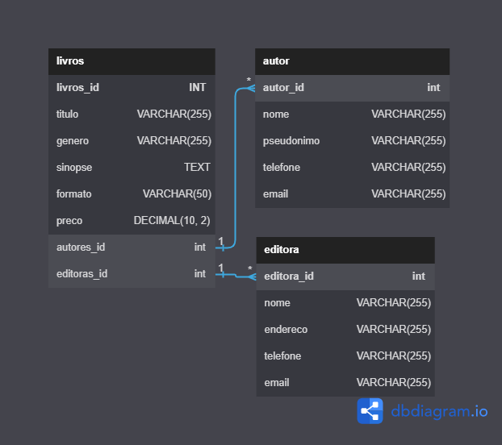

# Sistema de Gerenciamento de Biblioteca: Biblioteca Database


[License: MIT](https://opensource.org/licenses/MIT)

<br />
<div align="center">
  <a href="https://github.com/4Diovanni/Data-Base-Hospital.git">
    
  </a>
</div>

</h1>
<div align='center'>
Trabalho realizado no @Instituto Proa
  
designado ao professor Gabriel Augusto Azevedo
</div>
<h2>Descrição e requisitos para o banco de dados:</h2>
<span>
O Projeto de banco de dados de uma biblioteca é um projeto desenvolvido com o objetivo de usar os comandos basicos de um banco de dados. Ele foi criado utilizando MySql e tem como propósito de desenvolver aprendizado em analisar dados, consertalos e acrescentar de forma que o banco fique eficiente.
</span>

## 

## ⚡ Diagrama Entidade Relacionamento (ER)

#### Funcionalidades:

<br>

<br>

<ul>
  Todos os scripts abaixo devem ser usados e testados no banco que você vai usar para essa atividade. 
Você vai precisar utilizar 
 <li>ALTER TABLE</li>
 <li>DROP</li>
 <li>IF EXISTS</li>
 <li>IF NOT EXISTS e tudo o mais que vimos em aula</li> 
</ul>

#### Benefícios:

<li><strong>Conhecimento básico de bancos de dados:</strong> É recomendado ter uma compreensão básica dos conceitos de bancos de dados, como tabelas, colunas, chaves primárias, chaves estrangeiras.</li>
<br />
<li><strong>Familiaridade com a linguagem SQL:</strong> A linguagem SQL (Structured Query Language) é amplamente utilizada para interagir com bancos de dados. É importante ter um conhecimento básico da sintaxe e dos comandos SQL, como SELECT, UPDATE, DELETE e ALTER, que são utilizados nas 4 operações.</li>
<br />
<li><strong>Ambiente de desenvolvimento ou acesso a um banco de dados:</strong> É necessário ter acesso a um ambiente de desenvolvimento onde você possa criar e manipular um banco de dados. Isso pode incluir o uso de um sistema de gerenciamento de banco de dados (SGBD) como MySQL, PostgreSQL, Oracle, SQL Server, entre outros.</li>
<br />
<li><strong>Experiência prática:</strong> A melhor maneira de aprender as 4 operações é através da prática. Ter a oportunidade de realizar consultas, atualizações, exclusões e alterações em um banco de dados real ou simulado ajudará a aprimorar suas habilidades.</li>
<br />

## Um lugar para colocar nosso livros
* Crie um banco de dados chamado Biblioteca.
```
create database if not exists biblioteca;
use biblioteca;

drop table if exists livros;
```
Simples, né?

## ⚡ Tirandos os livros das prateleiras
Abaixo estamos criando uma pequena biblioteca com livros. 
A criação da nossa estante é este Script abaixo, que possui erros que impedem renderização completa. 

Você consegue encontrá-los?

* Código inicial
```
CREATE TABLE Livros (
    livros_id INT PRIMARY KEY,
    titulo VARCHAR(255),
    autor VARCHAR(255),
    editora VARCHAR(255),
    ano_publicacao INT,
    isbn VARCHAR(13),
);
INSERT INTO Livros (id, titulo, autor, editora, ano_publicacao, isbn) VALUES 
(1, 'A Culpa é das Estrelas', 'John Green', 'Intrínseca', 2012, '978-85-8057-346-6'),
(2, 'Harry Potter e a Pedra Filosofal', 'J.K. Rowling', 'Rocco', 1997, '9788532511010'),
(3, 'O Senhor dos Anéis: A Sociedade do Anel', 'J.R.R. Tolkien', 'Martins Fontes', 1954, '9788533603149'),
(4, 'The Catcher in the Rye', 'J.D. Salinger', 'Little, Brown and Company', '1951', '9780316769488'),
(5, '1984', 'George Orwell', 'Companhia Editora Nacional', 1949, '978-85-221-0616-9'),
(6, 'Percy Jackson e o Ladrão de Raios', 'Rick Riordan', 'Intrínseca', 2005, '9788598078355');
```
### ⚡ Retirando o pó

## Ainda trabalhando com código acima:

<ul>
<li>1. Adicione a regra <strong>AUTO_INCREMENT</strong> para a chave primária remova os dados referentes ao ID dos livros do script de inserção.</li>
<br/>
<li>2. Crie uma tabela para 'Autores' e outra para 'Editoras', para separar essas informações. Elas devem conter chaves primárias para gerar relacionamentos.</li>
<br/>
<li>3. Utilizando <strong>ALTER TABLE</strong>, elimine as colunas 'autor' e 'editora' da tabela 'Livros' e adicione as colunas 'autor_id' e 'editora_id' para fazer a referências como chave estrangeiras das referidas tabelas.</li>
<br/>
<li>4. Retire os valores para autores e para as editoras do script inicial e insira-os nas novas tabelas. </li>
</ul>


